# Setup a Static Website Using Nginx

## Introduction: 
This project deals with installing Nginx, Downloading a free HTML website files, creating an elastic IP address, validating the website using the IP address and validating the website SSL usingSSL utility.
Breakdown steps:
1.	On the console home I clicked on EC2, clicked on launch instance. I was able to access Launch Instant page.

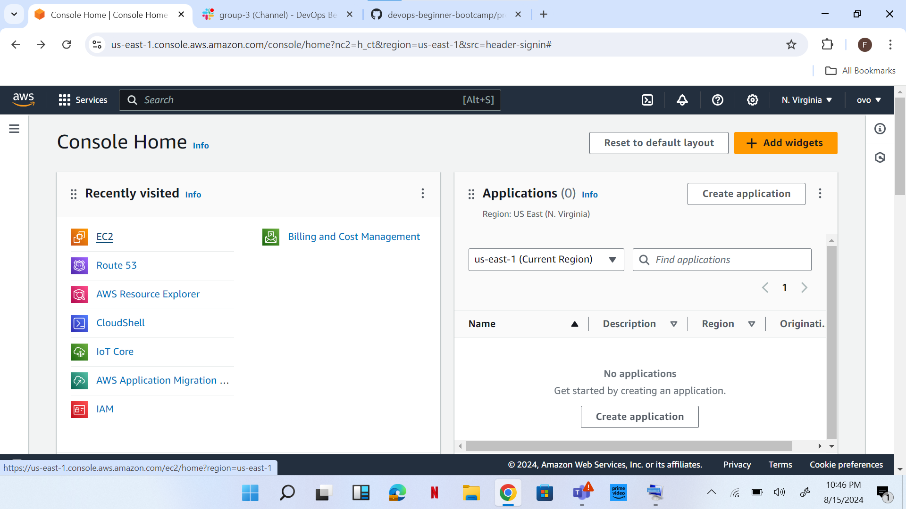
2.	Under name, I entered p1. I chose Ubuntu. SSH, HTTP and HTTPS access.
3.	I clicked launch instance to launch instance.

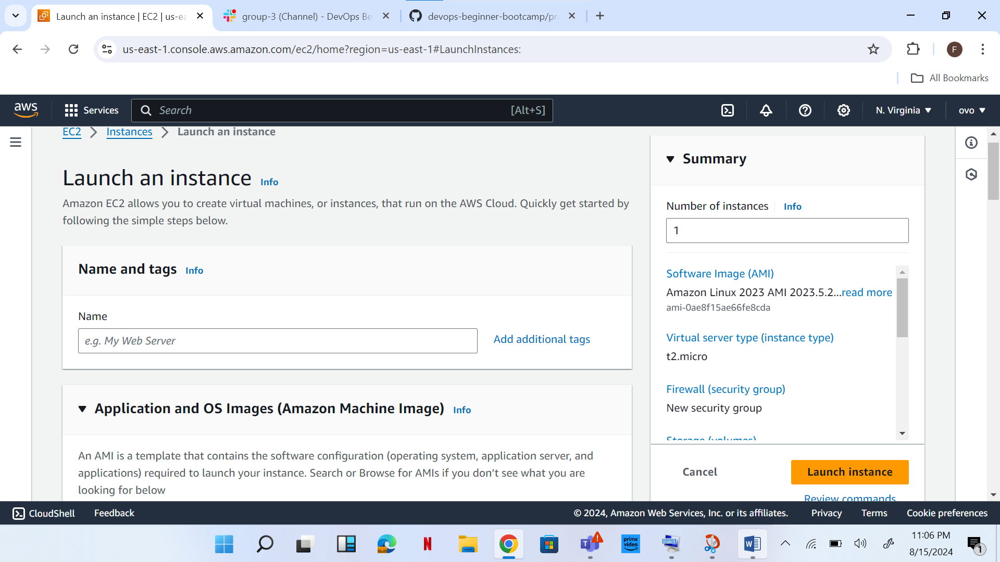
4.	Clicked on connect, copied command on SSH client.

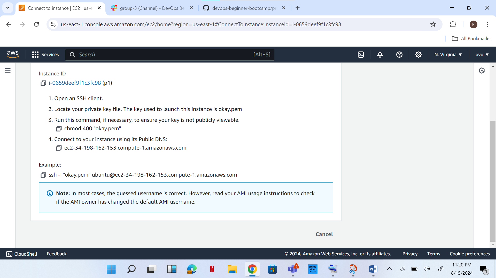
5.	Opened a terminal on my .pem file, okay.pem was was downloaded. I pasted the SSH command and 
pressed enter key.

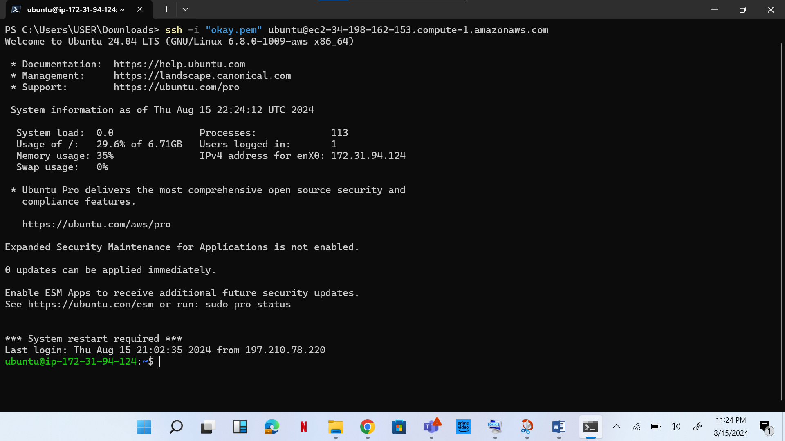
6.	I created an elastic IP and got it associated.

7.	Again I entered the command copied from SSH client, pasted it on terminal and clicked enter.

8. Install Nginx and Setup Your Website
   Execute the following commands:
   sudo apt update
   sudo apt upgrade
   sudo apt install nginx
9. Start my Nginx server by running the sudo     systemctl start nginx command.

10. continued with the next command:sudo systemctl enable nginx and then confirm if it's running with the sudo systemctl status nginx command.

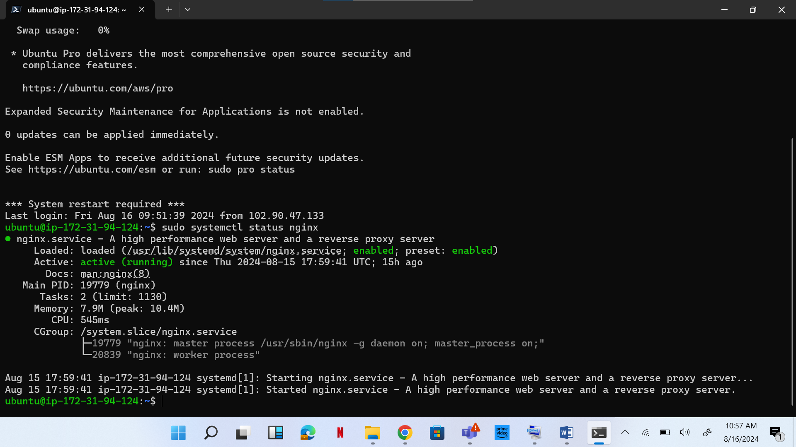
11.	My IP address, 34.198.162.153 pasted on web browser to confirm Nginx setup. This showed welcome to Nginx to confirm it.

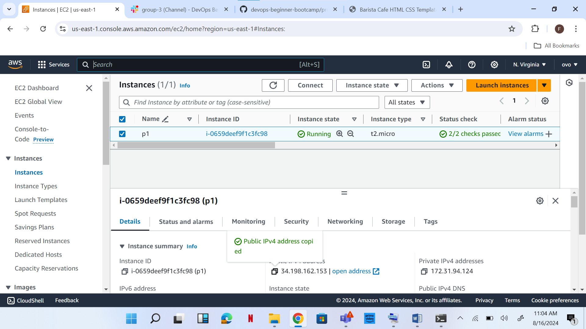
12.	I visited tooplate.com to download a free HTML website file.

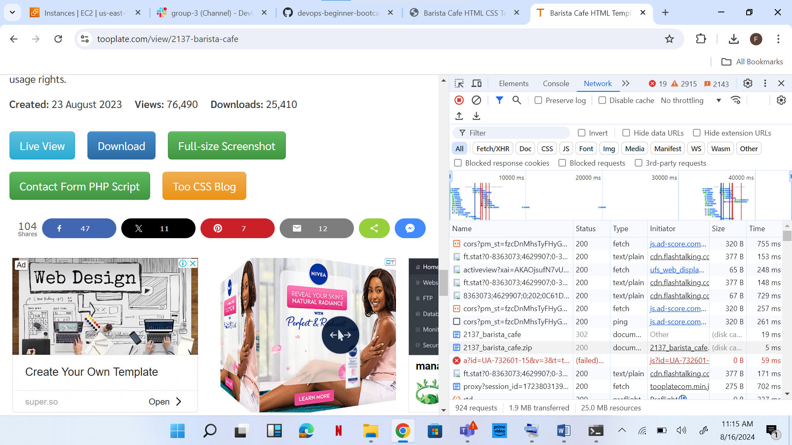
13.	sudo nano /etc/nginx/sites-available/default pasted on terminal and root directory edited.

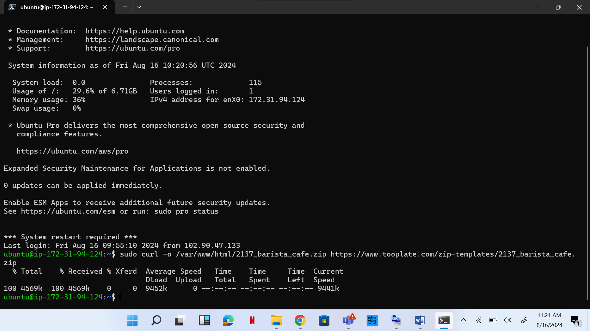
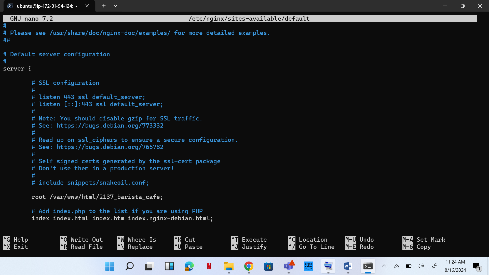
14.	IP address copied and pasted on a browser. It showed the free HTML page.

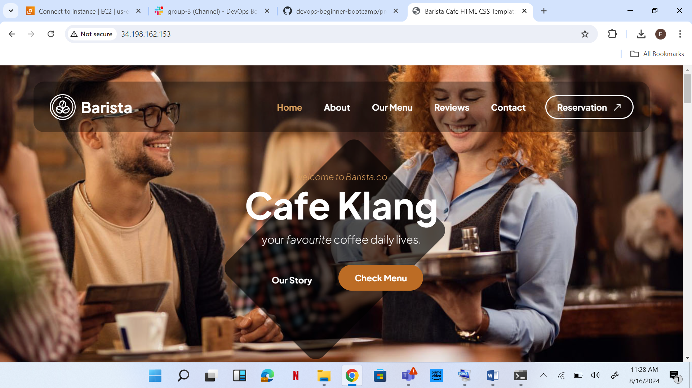

15.	I visited my domain and made some changes.

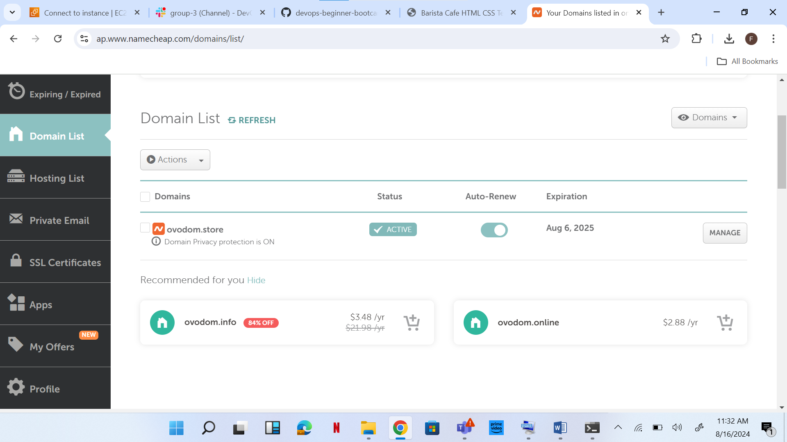

16.	Domain name entered on route 53 (AWS)

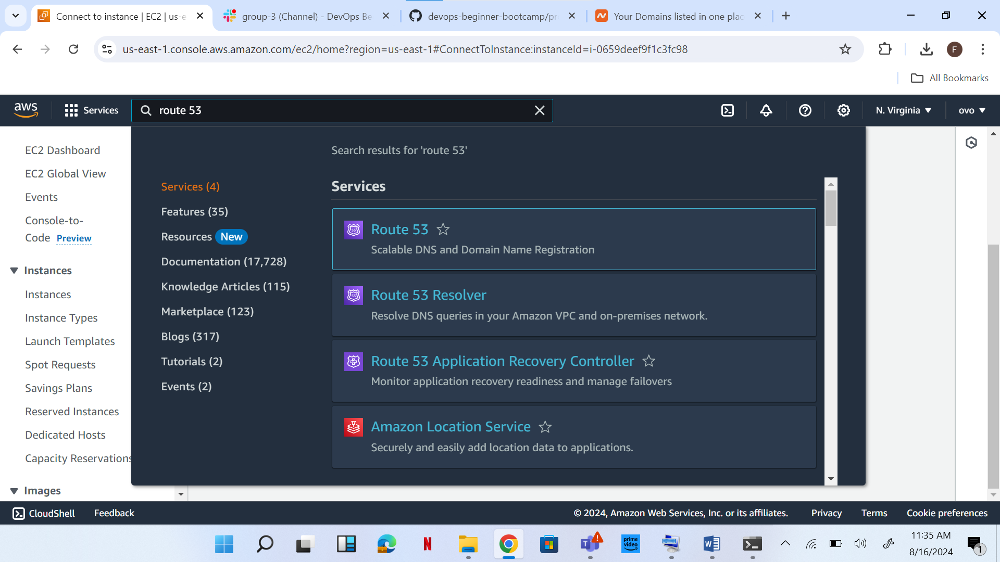
17. Records under value, copied. Drop custom DNS on domain and paste records copied.

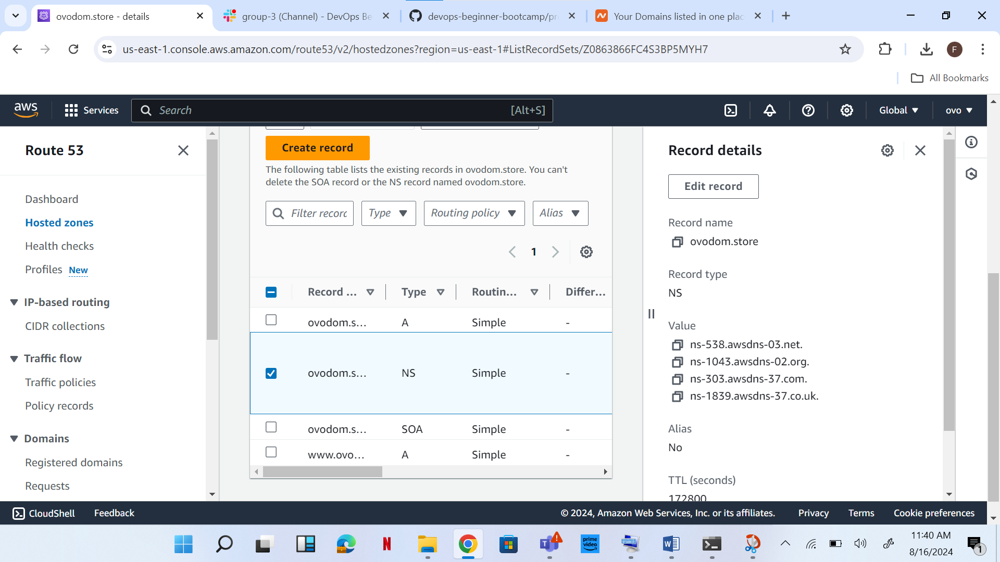
18.	sudo nano /etc/nginx/sites-available/default. This command was ran on the terminal and root, 
    the server name edited to domain name: ovodom.store www.ovodom.store and saved. 

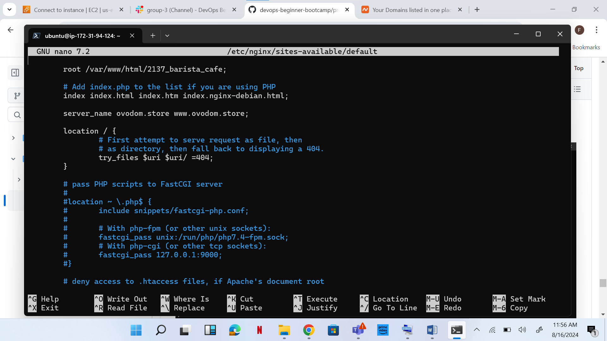

19.	sudo systemctl restart nginx run on terminal.

20.	Domain name entered on browser: ovodom.store

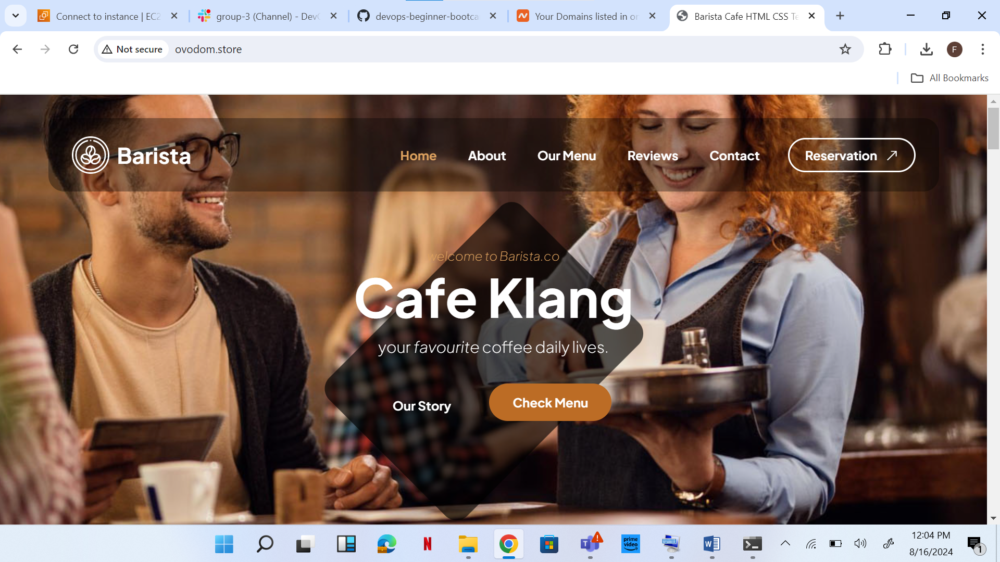
21.	sudo apt install certbot python3-certbot-nginx run on my terminal

22.	successful Next sudo certbot –nginx was ran on the terminal, where certificate was and deployed
23.	Finally ran openssl s_client -connect ovodom.store:443

24.	Visit to domain using https://ovodom.store.

