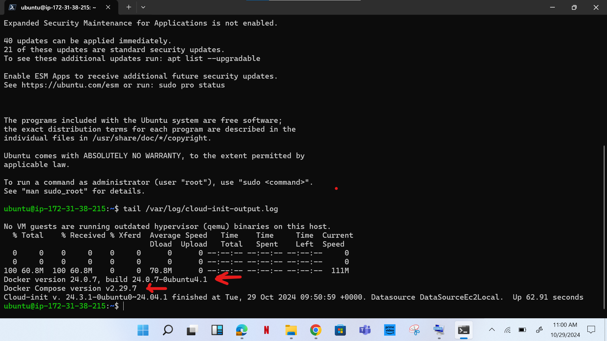
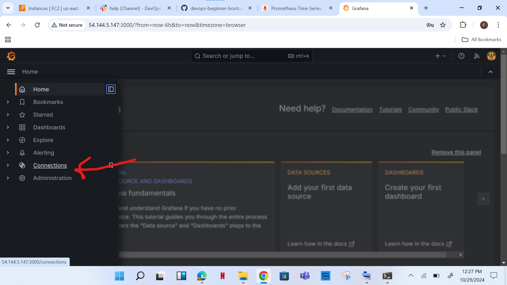

# Deploying the Prometheus Stack using Docker Compose

**Introduction:**

1.	Prometheus: Prometheus is an open-source monitoring system designed to collect metrics from various sources, such as application and system performance data, and store them in a time-series database. It scrapes metrics from exporters, processes them, and provides this data to visualization tools like Grafana for real-time monitoring and alerting.

2.	On this project, Prometheus will work with Alert Manager, Node Exporter, Grafana, Terraform(this is to generate server), Docker, and Docker Compose.

**Procedure:**

**1.	Spin up an Ubuntu 24.04 EC2 Instance and connect your instance via ssh.**


•	Visit I AM page on AWS to gain access to AmazonVPCFullAccess
•	AmazonEC2FullAccess


**2.	Provision server using Terraform**

- a. Connect your Instance via SSH

- b. Clone the project repository to your instance


```
git clone https://github.com/TobiOlajumoke/prometheus-observability-stack

```


cd into prometheus-observability-stack folder to get the project code.


```
cd prometheus-observability-stack
```


- c. Install Terraform


```
sudo snap install terraform --classic
```


**3. Provision Server Using Terraform**

- a. Modify the values of ec2.tfvars file present in the terraform-aws/vars folder

```
cd terraform-aws/vars

```


- b. If you are using us-west-2, you can continue with the same AMI ID else change the AMI ID

```
vi ec2.tfvars
```


```
# EC2 Instance Variables
region         = "us-west-2"
ami_id         = "ami-0aff18ec83b712f05"
instance_type  = "t2.large"
key_name       = "add keyname"
instance_count = 1
volume-size = 20

# VPC id
vpc_id  = "add a vpc"
subnet_ids     = "add a subnet"

# Ec2 Tags
name        = "prometheus-stack"
owner       = "devops-mastery"
environment = "dev"
cost_center = "devops-project"
application = "monitoring"

# CIDR Ingress Variables
create_ingress_cidr        = true
ingress_cidr_from_port     = [22, 80, 443, 9090, 9100, 9093, 3000]  # List of from ports
ingress_cidr_to_port       = [22, 80, 443, 9090, 9100, 9093, 3000]  # List of to ports
ingress_cidr_protocol      = ["tcp", "tcp", "tcp", "tcp", "tcp", "tcp", "tcp"]        # Protocol for all rules (you can add more if needed)
ingress_cidr_block         = ["0.0.0.0/0", "0.0.0.0/0", "0.0.0.0/0", "0.0.0.0/0", "0.0.0.0/0", "0.0.0.0/0", "0.0.0.0/0"]
ingress_cidr_description   = ["SSH", "HTTP", "HTTPS", "Prometheus", "Node-exporter", "Alert manager", "Grafana"]

# CIDR Egress Variables
create_egress_cidr    = true
egress_cidr_from_port = [0]
egress_cidr_to_port   = [0]
egress_cidr_protocol  = ["-1"]
egress_cidr_block     = ["0.0.0.0/0"]

```


Now we can provision the AWS EC2 & Security group using Terraform.

```
cd ../prometheus-stack

```


```
terraform fmt
```


```
terraform init
```


```
terraform validate
```


Execute the plan and apply the changes.

```
terraform plan --var-file=../vars/ec2.tfvars
```


```
terraform apply --var-file=../vars/ec2.tfvars
```


**4.	Connect to your new Instance**


Run the following command on your new instance:

```
tail /var/log/cloud-init-output.log
```
This is to check the cloud-init logs to see if the user data script has run successfully. An example output is shown below. It should show Docker and Docker compose versions as highlighted in the image.





verify the docker and docker-compose versions again.


```
sudo docker version
```


```
sudo docker-compose version
```


**5.	Deploy Prometheus Stack using Docker Compose**

First, clone the project code repository to the server.

```
git clone https://github.com/TobiOlajumoke/prometheus-observability-stack
```


```
cd prometheus-observability-stack
```


continue with the following command: 

```
make all
```


Bring up the stack using Docker Compose. It will deploy Prometheus, Alert manager, Node exporter and Grafana.


```
sudo docker-compose up -d
```


On a successful execution, you should see the following output saying Running 5/5


**6.	Validate Prometheus Node Exporter Metrics**

If you visit http://your-public-ip-address:9090, you will be able to access the Prometheus dashboard as shown below.

Validate the targets, rules and configurations as shown below. The target would be Node exporter url.


**7.	Validating Prometheus Rules and Targets**

Now lets execute a promQL statement to view node_cpu_seconds_total metrics scrapped from the node exporter.


```
avg by (instance,mode) (irate(node_cpu_seconds_total{mode!='idle'}[1m]))
```


You should be able to data in graph as shown below.


**8.	Configure Grafana Dashboards**

Grafana can be accessed at: http://your-ip-address:3000





**9.	Configure Node Exporter Dashboard**


Once the dashbaord template is imported, you should be able to see all the node exporter metrics as shown below.


**10.	Simulate and Test Alert Manager Alerts**

You can access the Alertmanager dashbaord on http://your-ip-address:9093


Alert rules are already backed in to the prometheus configuration through alertrules.yaml. If you go the alerts option in the prometheus menu, you will be able to see the configured alerts as shown below. http://your-ip-address:9090


Run the following command:

```
sudo docker exec -it prometheus promtool check rules /etc/prometheus/alertrules.yml
```


**11.	Test: High Storage & CPU Alert**


```
dd if=/dev/zero of=testfile_16GB bs=1M count=16384; openssl speed -multi $(nproc --all) &
```


.png)


**12.	Cleanup The Setup**

To tear down the setup, execute the following terraform command from your workstation.


```
cd prometheus-observability-stack/terraform-aws/prometheus-stack
```

```
terraform destroy --var-file=../vars/ec2.tfvars
```


