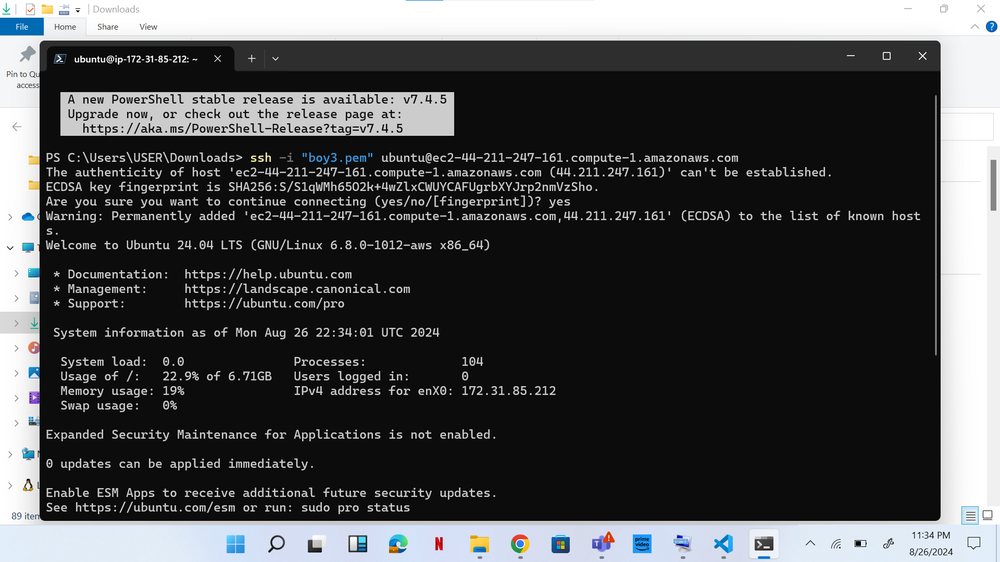
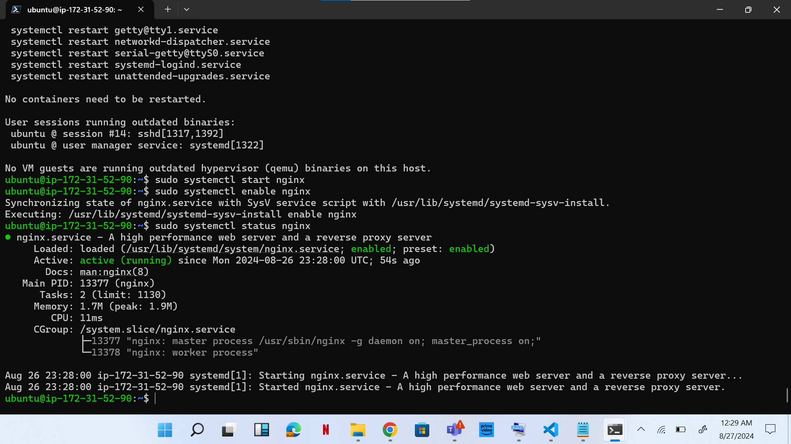
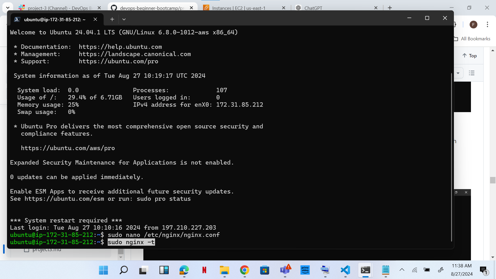

# Setup Load Balancing for Static Website Using Nignx

## INTRODUCTION: 
This project is about setting three servers in place with two having static IP address, two websites using Nginx are deployed to these servers, and the third server acts as a balancer (i.e the end product for the static servers reflects on this server). 

## PROCESS:
1.	Three Ubuntu servers generated.

2.	Elastic IP address created and attached for two.
3.	Downloaded website templates from website.

4.	Following commands were executed in order for Nginx to be installed 
sudo apt update
sudo apt upgrade
sudo apt install nginx
sudo systemctl start nginx
sudo systemctl enable nginx
sudo systemctl status nginx

5.	To unzip website files. The following command were executed
sudo apt install unzip
sudo curl -o /var/www/html/2126_antique_cafe.zip https://www.tooplate.com/zip-templates/2126_antique_cafe.zip && sudo unzip -d /var/www/html/ /var/www/html/2126_antique_cafe.zip && sudo rm -f /var/www/html/2126_antique_cafe.zip

6.	To start up website configuration. The following command was executed
sudo nano /etc/nginx/sites-available/café

7.	The following code was copied and pasted and the root directive is edited to show where website is stored

server {
    listen 80;
    server_name example.com www.example.com;

    root /var/www/html/example.com;
    index index.html;

    location / {
        try_files $uri $uri/ =404;
    }
}

8.	Create a symbolic link for both websites by running the following command

sudo ln -s /etc/nginx/sites-available/cafe /etc/nginx/sites-enabled/

9.	And run the following commands

sudo nginx –t to check the syntax of the Nginx configuration file, and when successful run run

sudo systemctl restart nginx

10.	The same process was repeated for the second server
11.	On the first and second server, run the following command 
sudo rm /etc/nginx/sites-enabled/default

12.	Run the sudo systemctl restart nginx command to restart your server
13.	Check both IP addresses to confirm your website is up and running

14.	Configure the third server
15.	Execute sudo nano /etc/nginx/nginx.conf to edit your Nginx configuration file.
16.	The following was added to the http block

    upstream cloudghoul {
    server 1;
    server 2;
    # Add more servers as needed
}

server {
    listen 80;
    server_name <your domain> www.<your domain>;

    location / {
        proxy_pass http://cloudghoul;
    }
}

      Placeholders edited. Private IP addresses for server one and two inputted and domain name changed.

17.	Run sudo nginx -t to check for syntax error.
18.	Apply the changes by restarting Nginx: sudo systemctl restart nginx
19.	Go to AWS and create record.
20.	Point your domain's DNS records to the IP addresses of your Nginx load balancer server.

21.	In route 53, select the domain name and click on Create record.
22.	Paste your IP address➀ and then click on Create records➁ to create the root domain.

Note: I later changed it to 44.211.247.161

23.	Click on create record again, to create the record for your sub domain.
Paste your IP address➀, input the Record name(www➁) and then click on Create records➂

24.	Go to the terminal you used in setting your first website and run sudo nano /etc/nginx/sites-available/café
 to edit your settings. Enter the name of your domain and then save your settings

 
25.	Restart your nginx server by running the sudo systemctl restart nginx command
26.	Do the same for second terminal used for the second website.

27.	Go to your domain name in a web browser to verify that your website is accessible.

28.	Install certbot by executing the following command
sudo apt update
•	sudo apt install python3-certbot-nginx
•	sudo certbot –nginx . This command is to request for your certificate   
29.	 Follow the instructions provided by certbot and select the domain name for which you would like to activate HTTPS

30.	Access your website to verify that Certbot has successfully enabled HTTPS.

31. Test renewal command in dry-run mode: sudo certbot renew --dry-run

