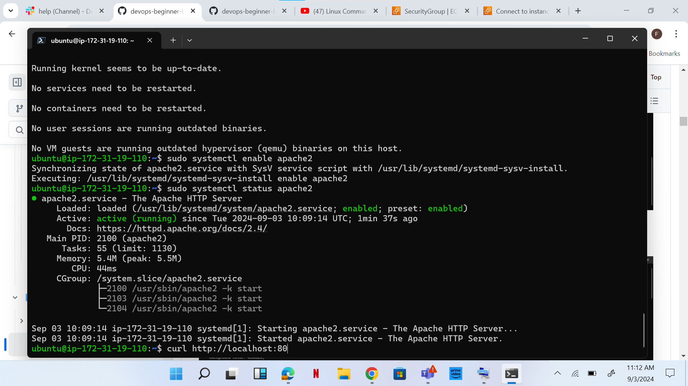
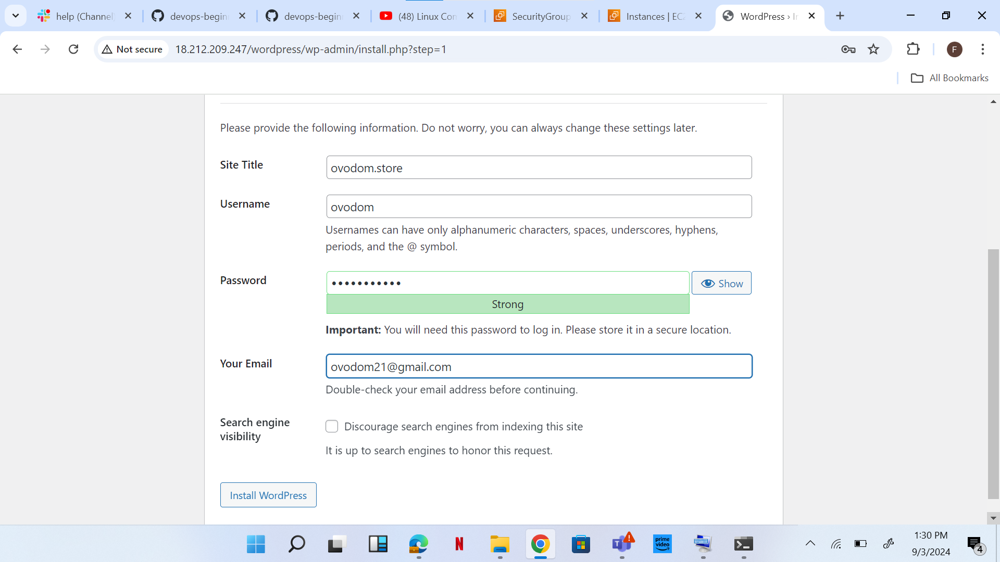
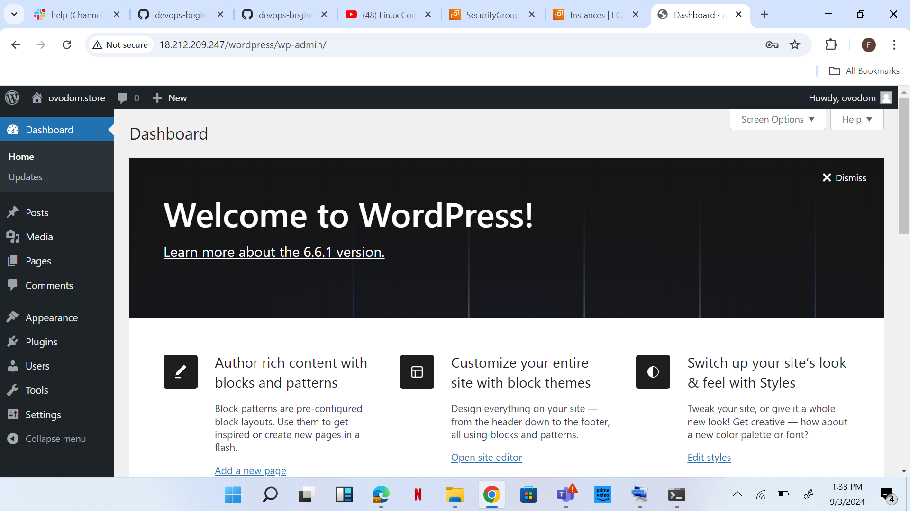

# Setup WordPress Website Using LAMP Stack

## INTRODUCTION:
This project deals with setting up a wordpress website using the LAMP stack. LAMP stands for Linux, Apache, MYSQL and PHP. It will show you the various steps taken to setting up your server environment and installing and configuring your wordpress website for ideal execution.

**Dynamics:**
1.	Set up an Ubuntu server


2.	Set an inbound rule for MYSQL in your security group


3.	Open your terminal and connect to your Ubuntu server via SSH


4.	Install Apache


5.	Enable Apache to start on boot with command, sudo systemctl enable apache2 
And verified status with the following command sudo systemctl status apache2


6.	check if our server is running and accessible both locally and from the Internet by executing the following command: curl http://localhost:80.





7.	Copy your public IPv4 address from your EC2 dashboard
8.	Open a web browser of my choice and try accessing the following URL: http:// 18.212.209.247:80


9.	Installed MYSQL


10.	Installed PHP


11.	Created a virtual host using Apache


12.	Visited my browser using 18.212.209.247:80


13.	Enable PHP on the website


14.	Reloaded Apache for the changes to take effect: sudo systemctl reload apache2.


15.	A new file was created named index.php inside my custom web root folder with the following command nano /var/www/projectlamp/index.php

16.	I copied and pasted

```

 <?php
phpinfo();

```

on the new file created.


17.	I went back to my web browser and refreshed. PHP page appeared.


18.	Installed wordpress


19.	Created a database for wordpress


20.	Configure wordpress








21.	Create an A record


.png)


22.	Installed cerbot and requested for SSL/TLS certificate.


23. visited ovodom.store


24. log in to wordpress with my username and password


