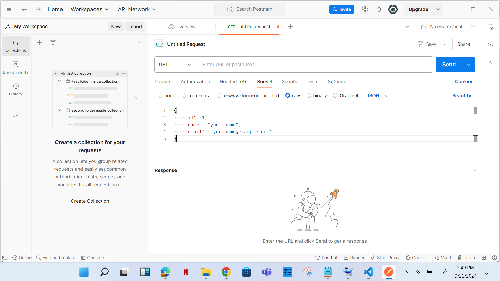

**Flask API Project**

**INTRODUCTION:**

This project is about how APIs works. API (Application programming interface) is a set of rules that allows different software applications to communicate with each other.

Dynamics of setting up a project

1.	Open your terminal in VS code 

    a.	Select a new terminal 
    
    b.	Select Gitbash 


2.	The following command is applied:


```
               mkdir -p flask_api_project/{templates,static} && touch flask_api_project/app.py    flask_api_project/templates/index.html flask_api_project/static/style.css && python -m venv flask_api_project/venv

```


3.	Project environment is created


4.	 (a). in the app.py file paste the code below


```

from flask import Flask, request, jsonify, render_template

app = Flask(__name__)

users = []

@app.route('/')
def home():
    return render_template('index.html')

@app.route('/users', methods=['POST'])
def create_user():
    user = request.get_json()
    users.append(user)
    return jsonify(user), 201

@app.route('/users', methods=['GET'])
def get_users():
    return jsonify(users), 200

@app.route('/users/<int:user_id>', methods=['GET'])
def get_user(user_id):
    user = next((u for u in users if u['id'] == user_id), None)
    return jsonify(user), 200 if user else 404

@app.route('/users/<int:user_id>', methods=['PUT'])
def update_user(user_id):
    user = request.get_json()
    index = next((i for i, u in enumerate(users) if u['id'] == user_id), None)
    if index is not None:
        users[index] = user
        return jsonify(user), 200
    return '', 404

@app.route('/users/<int:user_id>', methods=['DELETE'])
def delete_user(user_id):
    global users
    users = [u for u in users if u['id'] != user_id]
    return '', 204

if __name__ == '__main__':
    app.run(debug=True)

```


     
       (b). In the index.html in the templates directory paste the code below: 


```
           <!DOCTYPE html>
<html lang="en">
<head>
    <meta charset="UTF-8">
    <meta name="viewport" content="width=device-width, initial-scale=1.0">
    <title>API-Based Application</title>
    <link rel="stylesheet" href="{{ url_for('static', filename='style.css') }}">
</head>
<body>
    <h1>User Management</h1>
    <form id="userForm">
        <input type="text" id="name" placeholder="Name" required>
        <input type="email" id="email" placeholder="Email" required>
        <button type="submit">Add User</button>
    </form>
    <ul id="userList"></ul>

    <script>
        document.getElementById('userForm').addEventListener('submit', async function (event) {
            event.preventDefault();
            const name = document.getElementById('name').value;
            const email = document.getElementById('email').value;
            
            const response = await fetch('/users', {
                method: 'POST',
                headers: {
                    'Content-Type': 'application/json'
                },
                body: JSON.stringify({ name, email })
            });

            const user = await response.json();
            document.getElementById('userList').innerHTML += `<li>${user.name} (${user.email})</li>`;
        });
    </script>
</body>
</html>  

```


     (c).  In the style.css in the static directory paste this code below there:


```
          body {
    font-family: Arial, sans-serif;
    margin: 20px;
}

form {
    margin-bottom: 20px;
}

input {
    margin-right: 10px;
}

```


5.	Following command is entered:


```
python -m venv venv
source venv/Scripts/activate
pip install Flask

```


6.	Run flask application 


```
flask run

```


7.	Open your browser and go to http://127.0.0.1:5000 to see your application.


8.	Create a new request on postman


9.	Set the request type to POST and enter http://127.0.0.1:5000/users

•	Go to the Body tab, select raw, and choose JSON from the dropdown.
•	Enter the JSON data:





•	Click Send and check the response.
and the response will be like this:


