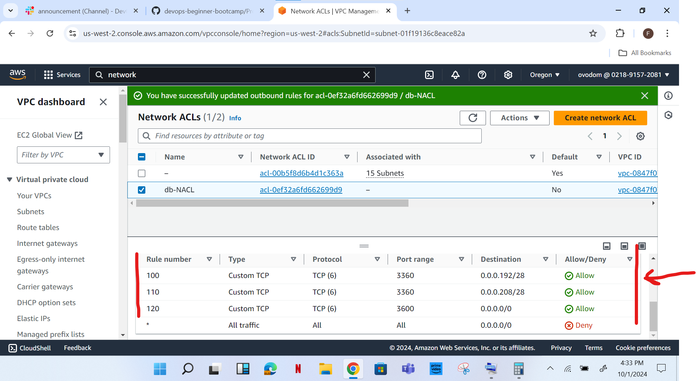

# AWS VPC Project

**INTRODUCTION:**

A VPC (Virtual Private Cloud) in AWS (Amazon Web Services) is a service that lets you start AWS resources in a wise isolated virtual network that you define. Below is a couple of components and features of an AWS VPC:
1.	Subnets
2.	IP addresses 
3.	Route Tables
4.	Internet Gateway
5.	NAT Gateway and NAT Instances 
6.	Security Groups
7.	Network ACLs
8.	VPC Peering
9.	VPN Gateway
10.	VPC Endpoints
11.	AWS Direct Connect.

**DYNAMICS:**

**Step 1**

Create a VPC for project and assign attach an internet gateway to it.

•	Login to your AWS management console and search VPC 

•	create an Internet Gateway

•	Attach Internet Gateway to VPC

.png)

**Step 2**

•	Create The Public Subnet

•	Create The Private Subnets following the same steps taken for the creation of the public subnet also having subnets for 2b and 2c:

•	Create for Database, Management and Platform (Note: These are Private)

You will have something like this,

**Step 3**

Route Table Design

•	Create Public Route Table and their subnet association.

•	Create Private Route Table (Application, Database, Management and Platform)

**Step 4**

NAT Gateway

•	Select a Subnet and allocate an IP address

**Step 5**

Adding the NAT Gateway to the Route Tables one after the other

•	add route to each Route Table 

•	Notice the status of the NAT gateway is active

•	add route for Route Table (public)

**Step 6**

AWS VPC Topology

**Step 7**

Network ACLs

DB NACL (Inbound Rules)

DB NACL (Outbound Rules)

 

