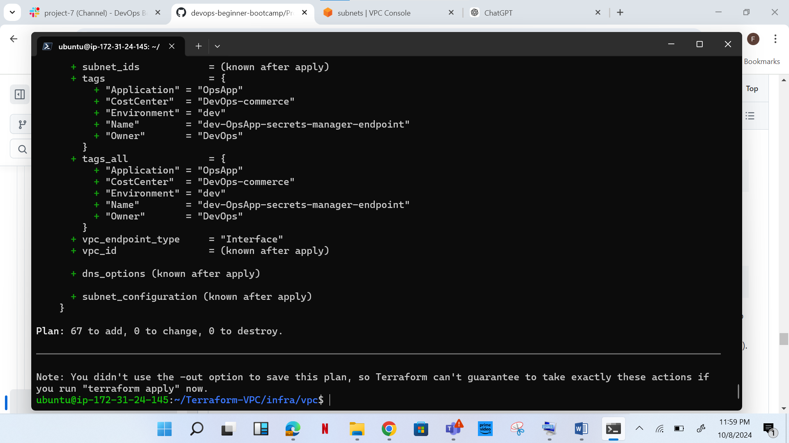

# AWS VPC using Terraform
Introduction:
This project deals with creating your VPC (Virtual Private Cloud), its subnets, Internet Gateway, NAT Gateway, Route Tables etc. in AWS automatically using terraform.

**Dynamics:**

1.	
•	Amazon VPC full access
•	Amazon EC2 full access


2.	
•	Create an EC2 instance, Ubuntu 22.04

•	Attach the Roles created earlier to the instance


3.	
•	Connect to your instance via SSh

•	Install Terraform

enter the following command to install terraform


```
sudo snap install terraform
```


- Then cd in to the terraform-vpc folder


```
cd terraform-vpc
```


   Terraform AWS VPC Creation Workflow


1.	CIDR Block: 10.0.0.0/16
2.	Region: us-west-2

3.	Availability Zones: us-west-2a, us-west-2b,     us-west-2c
4.	Subnets: 15 Subnets (One per availability Zone)
5.	Public Sunets (3)
6.	App Subets (3)
7.	DB Subnets (3)
8.	Management Subnet (3)
9.	Platform Subnet (3)
10.	NAT Gateway for Private subnets
11.	Internet Gateway for public subnets.


Steps:


A.	

a.	Clone the repo below into the instance and CD in the cloned repository

```

git clone https://github.com/TobiOlajumoke/Terraform-VPC.git

```


```

cd terraform-vpc

```


b.

•	CD into vars/dev/vpc.tfvars

•	Copy and paste the configuration below, change #tag owner to your name


```
#vpc
region               = "us-west-2"
vpc_cidr_block       = "10.0.0.0/16"
instance_tenancy     = "default"
enable_dns_support   = true
enable_dns_hostnames = true

#elastic ip
domain = "vpc"

#nat-gateway
create_nat_gateway = true

#route-table
destination_cidr_block = "0.0.0.0/0"

#tags
owner       = "DevOps"
environment = "dev"
cost_center = "DevOps-commerce"
application = "OpsApp"

#subnet

map_public_ip_on_launch       = true

public_subnet_cidr_blocks     = ["10.0.1.0/24", "10.0.2.0/24", "10.0.3.0/24"]
app_subnet_cidr_blocks        = ["10.0.4.0/24", "10.0.5.0/24", "10.0.6.0/24"]
db_subnet_cidr_blocks         = ["10.0.7.0/24", "10.0.8.0/24", "10.0.9.0/24"]
management_subnet_cidr_blocks = ["10.0.10.0/24", "10.0.11.0/24", "10.0.12.0/24"]
platform_subnet_cidr_blocks   = ["10.0.13.0/24", "10.0.14.0/24", "10.0.15.0/24"]
availability_zones            = ["us-west-2a", "us-west-2b", "us-west-2c"]

#public nacl

ingress_public_nacl_rule_no    = [100]
ingress_public_nacl_action     = ["allow"]
ingress_public_nacl_from_port  = [0]
ingress_public_nacl_to_port    = [0]
ingress_public_nacl_protocol   = ["-1"]
ingress_public_nacl_cidr_block = ["0.0.0.0/0"]

egress_public_nacl_rule_no    = [200]
egress_public_nacl_action     = ["allow"]
egress_public_nacl_from_port  = [0]
egress_public_nacl_to_port    = [0]
egress_public_nacl_protocol   = ["-1"]
egress_public_nacl_cidr_block = ["0.0.0.0/0"]

#app nacl

ingress_app_nacl_rule_no    = [100]
ingress_app_nacl_action     = ["allow"]
ingress_app_nacl_from_port  = [0]
ingress_app_nacl_to_port    = [0]
ingress_app_nacl_protocol   = ["-1"]
ingress_app_nacl_cidr_block = ["0.0.0.0/0"]

egress_app_nacl_rule_no    = [200]
egress_app_nacl_action     = ["allow"]
egress_app_nacl_from_port  = [0]
egress_app_nacl_to_port    = [0]
egress_app_nacl_protocol   = ["-1"]
egress_app_nacl_cidr_block = ["0.0.0.0/0"]

##db nacl

ingress_db_nacl_rule_no    = [100]
ingress_db_nacl_action     = ["allow"]
ingress_db_nacl_from_port  = [0]
ingress_db_nacl_to_port    = [0]
ingress_db_nacl_protocol   = ["-1"]
ingress_db_nacl_cidr_block = ["0.0.0.0/0"]

egress_db_nacl_rule_no    = [200]
egress_db_nacl_action     = ["allow"]
egress_db_nacl_from_port  = [0]
egress_db_nacl_to_port    = [0]
egress_db_nacl_protocol   = ["-1"]
egress_db_nacl_cidr_block = ["0.0.0.0/0"]

##management nacl

ingress_management_nacl_rule_no    = [100]
ingress_management_nacl_action     = ["allow"]
ingress_management_nacl_from_port  = [0]
ingress_management_nacl_to_port    = [0]
ingress_management_nacl_protocol   = ["-1"]
ingress_management_nacl_cidr_block = ["0.0.0.0/0"]

egress_management_nacl_rule_no    = [200]
egress_management_nacl_action     = ["allow"]
egress_management_nacl_from_port  = [0]
egress_management_nacl_to_port    = [0]
egress_management_nacl_protocol   = ["-1"]
egress_management_nacl_cidr_block = ["0.0.0.0/0"]

#platform nacl

ingress_platform_nacl_rule_no    = [100]
ingress_platform_nacl_action     = ["allow"]
ingress_platform_nacl_from_port  = [0]
ingress_platform_nacl_to_port    = [0]
ingress_platform_nacl_protocol   = ["-1"]
ingress_platform_nacl_cidr_block = ["0.0.0.0/0"]

egress_platform_nacl_rule_no    = [200]
egress_platform_nacl_action     = ["allow"]
egress_platform_nacl_from_port  = [0]
egress_platform_nacl_to_port    = [0]
egress_platform_nacl_protocol   = ["-1"]
egress_platform_nacl_cidr_block = ["0.0.0.0/0"]

#endpoint

create_s3_endpoint              = true
create_secrets_manager_endpoint = true
create_cloudwatch_logs_endpoint = true

```


B.	Initialize Terraform and Execute the Plan

- Now cd in to infra/vpc folder and execute the terraform plan to validate the configurations.

```
cd infra/vpc
```

- initialize terraform


- execute the plan

```
terraform plan -var-file=../../vars/dev/vpc.tfvars
```





C.	Create VPC With Terraform Apply

```
terraform apply -var-file=../../vars/dev/vpc.tfvars
```


D.	Validate VPC


 
E.	Cleanup the Resources


